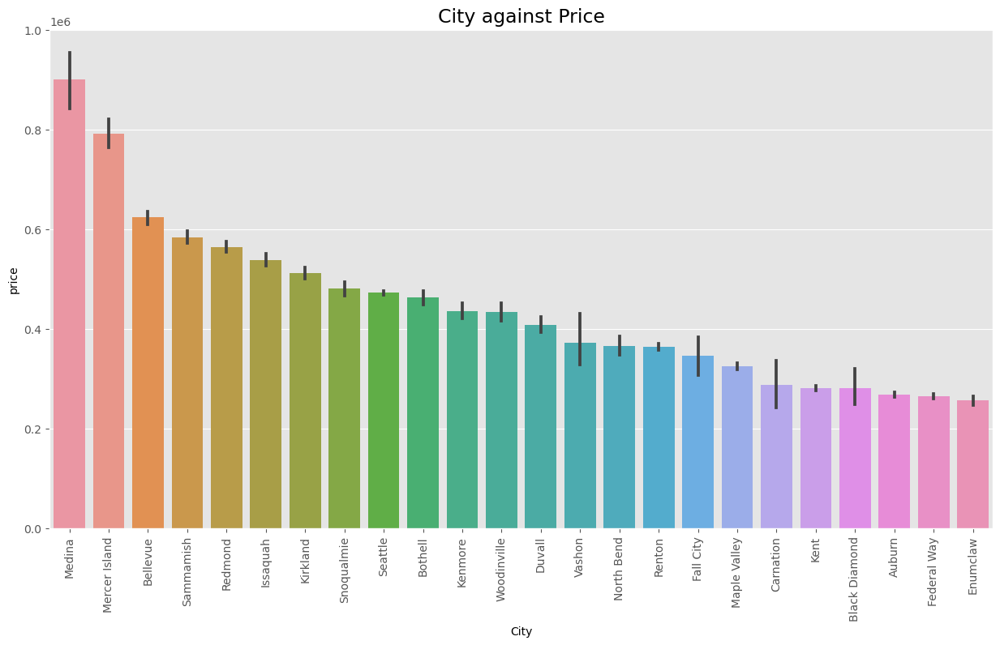
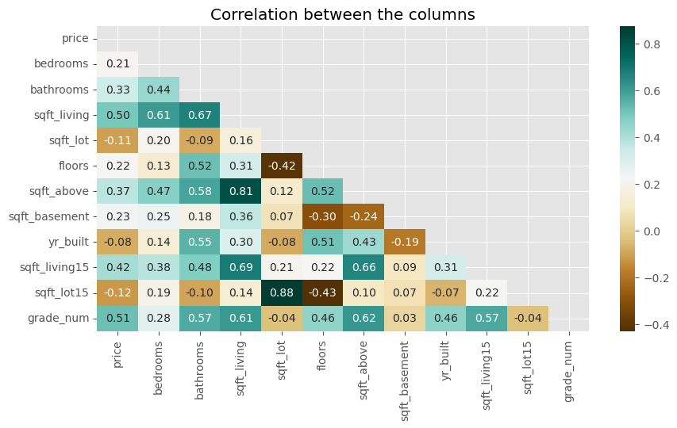

# Real Estate Analysis, King County.

## Business Understanding

### a) Overview
[King County](https://en.wikipedia.org/wiki/King_County,_Washington) is a populous county in Washington state, that is located in the northwestern region of USA. It include Seattle city which is the county seat, and comprises 29% of washington's population,outof the 39 counties in the state, with  56.72% of its population being home owners while 43.28% being. The county is the home various attractions, companies, amenities and opportunities among others. For more demographics and information of the county view this [link](https://www.point2homes.com/US/Neighborhood/WA/King-County-Demographics.html).

Real estate agencies, licensed professional organisations, are the bridge between buyers and sellers of real estate properties. They guide estate buyers and sellers by; providing unbiased insights and advice , manage negotiations on behalf of buyer / seller and keep documentations required for the estate transaction. Real estate agencies usually receive income from sales on commisions made from property sales, which generally rabges between 5-6% of the property's sale price.

### Problem Statement
Being part of a real estate agency that guides potential property owners / sellers on the marketing process of their property, through; comprehensive market research and analysis to determine the property's market price, identify the best places to invest resources in improvements, and identify the property's top selling points. 

We will be conducting an analysis of king county property sales data in order to be able to guide potential property owners on the best and most effective way to market their property. This can be achieved by identifying crucial areas for improvement and identifying the property's top selling points in order to acquire favorable and high market prices for their properties. This is aimed at improving the property transactions completion threshold for the agency, and in return increase sales revenues to the agency through commissions made for the property sales.

### Main Objective
To develop a predictive regression model that accurately predicts the sale price of a property while identifying crucial areas for improvement in order to increase property prices. As well as coming up with insights to well describe some property top selling points that are associated with high market prices.

### Metrics of Success
Accurately predicting the price of a property based on its feature and outlining key areas that can be acted upon to improve the overall sale price.

### Specific Objectives
* Identify house features that collectively correspond to high market prices.
* Develop a regression model to accurately predict the market price of a house based on its features/ properties.
* Evaluate the performance of the model in predicting market prices.
* From the model identify features that can be improved to increase the house price

## Data Understanding

The dataset used in this project, `kc_house_data.csv` data, contains information/ properties of houses sold in King county region within the year 2014 and 2015. It contains `21597rows` and `20 columns`, with the columns description as below;
* `id` - Unique identifier for a house
* `date` - Date house was sold
* `price` - Sale price (prediction target)
* `bedrooms` - Number of bedrooms
* `bathrooms` - Number of bathrooms
* `sqft_living` - Square footage of living space in the home
* `sqft_lot` - Square footage of the lot
* `floors` - Number of floors (levels) in house
* `waterfront` - Whether the house is on a waterfront
    * Includes Duwamish, Elliott Bay, Puget Sound, Lake Union, Ship Canal, Lake Washington, Lake Sammamish, other lake, and river/slough waterfronts
* `view` - Quality of view from house
    * Includes views of Mt. Rainier, Olympics, Cascades, Territorial, Seattle Skyline, Puget Sound, Lake Washington, Lake Sammamish, small lake / river / creek, and other
* `condition` - How good the overall condition of the house is. Related to maintenance of house.
    * See the [King County Assessor Website](https://info.kingcounty.gov/assessor/esales/Glossary.aspx?type=r) for further explanation of each condition code
* `grade` - Overall grade of the house. Related to the construction and design of the house.
    * See the [King County Assessor Website](https://info.kingcounty.gov/assessor/esales/Glossary.aspx?type=r) for further explanation of each building grade code
* `sqft_above` - Square footage of house apart from basement
* `sqft_basement` - Square footage of the basement
* `yr_built - Year` when house was built
* `yr_renovated` - Year when house was renovated
* `zipcode` - ZIP Code used by the United States Postal Service
* `lat` - Latitude coordinate
* `long` - Longitude coordinate
* `sqft_living15` - The square footage of interior housing living space for the nearest 15 neighbors
* `sqft_lot15` - The square footage of the land lots of the nearest 15 neighbors

The project also use `City Names.csv` dataset webscaped from the [Zipcode website ](https://www.zipcode.com.ng/2022/06/list-of-washington-zip-codes.html). `City Names.csv` dataset, contains zipcode names for king county zipcodes contained in the `kc_house_data.csv` dataset, . The dataset has `500 rows` and `4 columns` namely **City ,zipcode, County and State**.

## Data Preparation

In this section, the two data sets were merged and all the un-relevant columns were dropped. The remaining columns underwent data cleaning to prepare them for analysis, this are the various data cleaning methods that were used;

 &#9672 Converting columns into the requires data type 

 &#9672  Checking and removing duplicates
 

 &#9672 Dealing with missing data and placeholders of missing data by dropping the rows 

 &#9672 Removing outliers 

## Data Analysis
EDA was carried on the cleaned data, as seen in this [notebook](https://github.com/sha-ddie/Phase-2-Project/blob/main/student.ipynb), and various patterns and relationships between dependent and independent variables were discovered. 

This shows how the value of the dependent variable changes as the value of any of the independent variables (`waterfront`, `view`, `condition` and `grade`) above change. Also it depicts a relatiosnhsip between the variables and the dependent varianble price.

This graph shows how prices of house changes in different cities with **Medina, Merce Island** and **Bellevue** , being generally more expensive than those frome the other locations/cities. This can be due to the fact that, the above cities are all close to Seattle the city capital and they posses waterfront properties, and scenic views that as shown above fetch high market prices for houses.

The heatmap below shows how the numeric variables are correlated with price.

The following variables were used in modeling because of their relationship with price; `bedrooms` , `bathrooms` , `sqft_living` , `floors` , `sqft_basement` and `grade_num`. The following categorical variables were added to the model, to increase the models varibility; `waterfront` , `view` and `condition`.
Since all the independent variable have a linear relationship with price and our target variable is continous in nature, therefore we will use regression analysis to build a model that predicts the house price of a property given its feature.

The model created is statistically significant at an alpha of 0.05. All the model parameters are statistically significant given an alpha level of 0.05 except `condition_Average` , `condition_Fair` and `condition_Good` which were insignificant. Interpretation of the model parameters.

* **The house price of a house with `3` bedhrooms, `2` bathrooms ,`1,794 sqft ` square feet of living space, `2 ` floors,`233 sqft ` square feet of space of basement and `Average` grade is estimated to be: `$444,860` USD.**

* As we increase number of bedrooms by one from 3 , house price drops by `$18,564` USD.
* As we increase number of bathrooms by one from 2 , house price drops by `$37,731` USD.
* As we increase living space by 1 square foot from 1,974 , house price increase by `$101` USD.
* As we increase number of floors by one from 2 , house price increases by `$25,548` USD.
* As we increase basement space by 1 square foot from 233 sqft , house price increase by `$90` USD.
* As the house grade rises form Average by one level upwards, house price increase by `$8,7890` USD.

* The price of a house on a `waterfront` is `$104,200` higher as compared with one that is not.
* The price of a house with an `Average` view is `$88,000` higher as compared without a view.
* The price of a house with an `Excellent` view is `$213,700` higher as compared without a view.
* The price of a house with an `Fair` view is `$89,050` higher as compared without a view.
* The price of a house with an `Good` view is `$85,080` higher as compared without a view.
* The price of a house with a `Very Good` condition is `$98,780` higher as compared to a poor condition

The model has a low r-squared and a high prediction errors, therefore it should be majorly used for inferential purposes and not for prediction.

## Conclusions
Some of the house top selling points are:
* `waterfront` : Houses on a water front, that is houses around lakes, rivers and canals, fetches a high market prices than those that don't.
* `view` : Houses with an Excellent view, Mountains, Cascades, ake / river / creek, and others, have higher prices.
* `condition`: Houses in a very good condition, well maintained and renovated , have high market prices.
* `grade`: Houses with a Better grade , construction interms of interior and exteriour design, correspond to high prices
* `Location`: House locations such as houses from Medina, Merce Island and Bellevue , are generally more expensive than those frome the other locations/cities. This can be due to the fact that, the above cities are all close Seattle the city capital and they posses waterfront properties, and scenic views that as discussed above fetch high market prices for houses.

The final model was much better than the the baseline as it explains 39% of variations in price as compared to 35% in the baseline model. Also using the root mean square error , **our model is off by  `$143,789` USD in a given prediction** which is better than the baselines root mean square error of `$148,607`.

From our mdel we also found that; 
> `grade` has the most positive impact on the house price followed by `sqft_living`, `sqft_basement` then `floors`.
    
> `bathrooms` has the most negative on house price followed by `bedrooms`.

An increase in living spaces, basement space, and the number of floors leads to an increase in the market prices of a house.

An increase in the number of bathrooms and bedrooms leads to a drop in the price of a house. 

## Recommendations

* The model has a low r-squared and a high prediction errors, therefore it should be majorly used for inferential purposes and not for prediction.
* The top selling points of a house that catch high prices are; house on a waterfront, house with an excellent view, house with a very good condition , location of a house majorly in Medina, Merce Island and Bellevue , grade of the house, living and basement space of the house and the number of floors.

* A house should be well maintained and renavated, since grade of a house has the most impact / increase on price, therefore a home owner/seller should renovate and upgrade the interior and exteriour design and construction quality of a house

* We also found that, as the following features increase ; house living space, house basement space and number of floors, the market price of a house also increases.

* The number of bathrooms and bedrooms should be kept on average, that is 3 bedrooms and 2 bathrooms,since as they increase the price of a house drops.

## Resources.
1: For the complete notebook analysis, here is the [Notebook](https://github.com/sha-ddie/Phase-2-Project/blob/main/student.ipynb)

2: The Presentation slides are found [here](https://www.canva.com/design/DAFoI_Nmu3c/kbfegYg_PTdFzmdDfQ81Dg/view?utm_content=DAFoI_Nmu3c&utm_campaign=designshare&utm_medium=link&utm_source=publishsharelink#1)